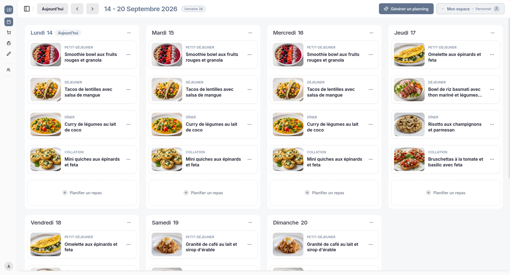
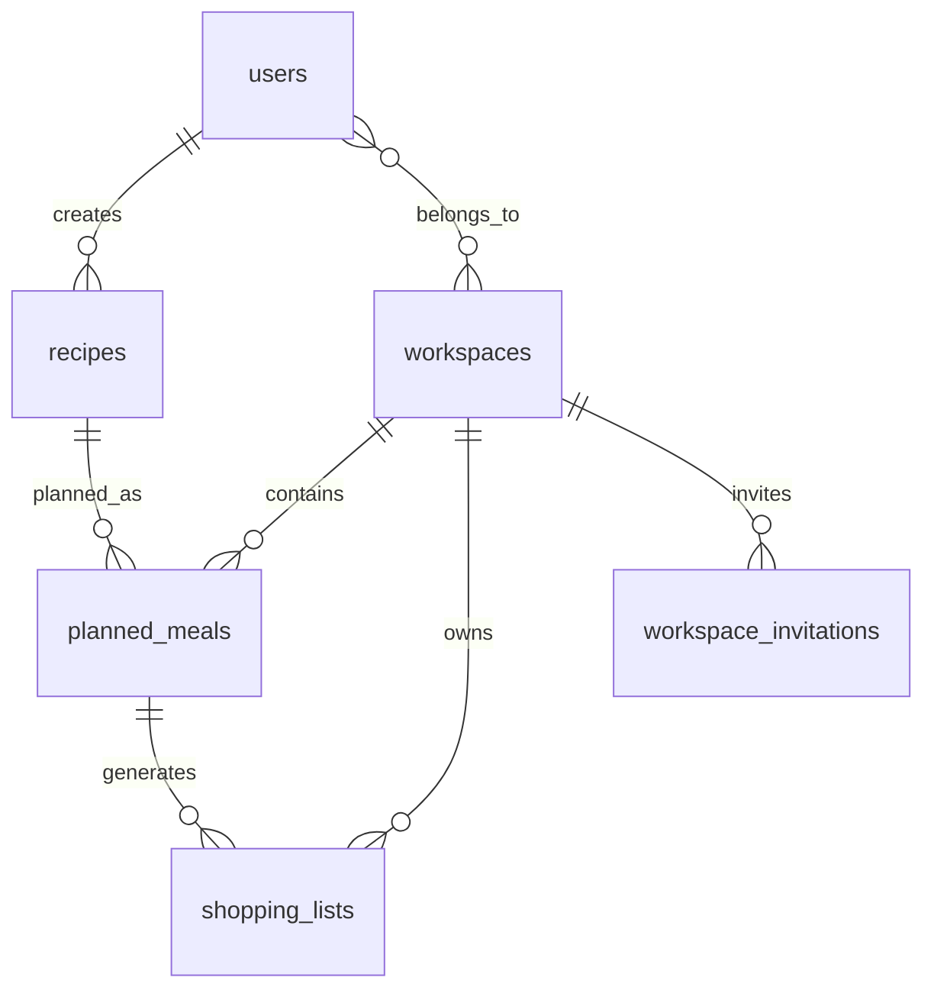
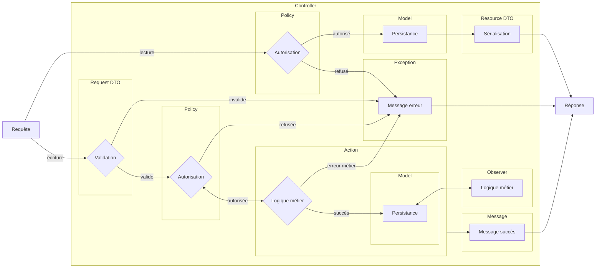
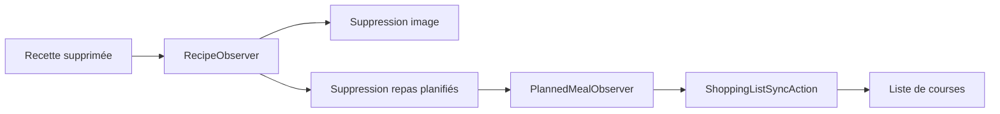
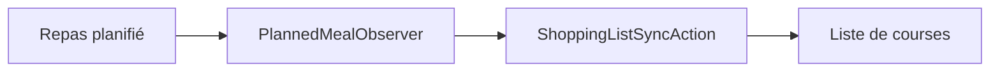
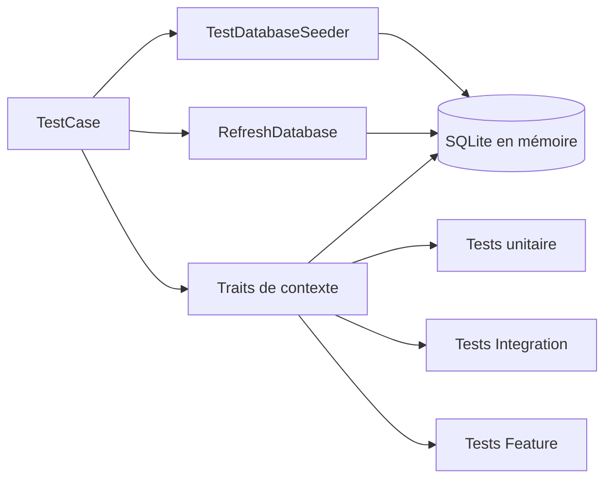
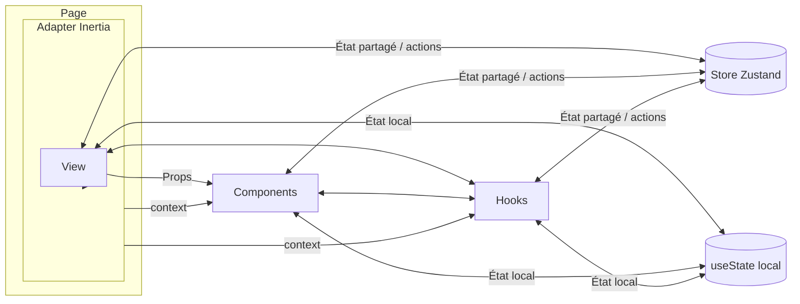
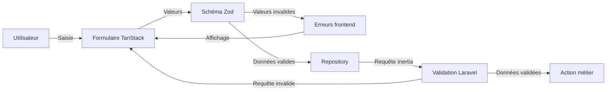

Mealo Planner est une application web full-stack développée avec Laravel, Inertia.js, React et TypeScript. Elle permet de gérer des recettes, de planifier des repas dans des espaces personnels ou partagés et de générer automatiquement une liste de courses à partir du planning.

L'application intègre également des fonctionnalités d'intelligence artificielle permettant de générer des recettes, de créer des visuels et de proposer des plannings de repas à partir des recettes enregistrées.



## Sommaire

- [Sommaire](#sommaire)
- [Prérequis](#prérequis)
- [Installation](#installation)
- [Démarrage](#démarrage)
- [Backend](#backend)
    - [1. Stack Technique](#1-stack-technique)
    - [2. Modèle logique de données : principales entités métier et relations](#2-modèle-logique-de-données--principales-entités-métier-et-relations)
    - [3. Controllers : orchestration du traitement d’une requête](#3-controllers--orchestration-du-traitement-dune-requête)
    - [4. Resource DTOs : transformation des données envoyées](#4-resource-dtos--transformation-des-données-envoyées)
    - [5. Request DTOs : validation et typage des données reçues](#5-request-dtos--validation-et-typage-des-données-reçues)
    - [6. Policies : gestion des autorisations](#6-policies--gestion-des-autorisations)
    - [7. Actions : isolation des traitements applicatifs](#7-actions--isolation-des-traitements-applicatifs)
    - [8. Observers : événements Eloquent et synchronisation des données](#8-observers--événements-eloquent-et-synchronisation-des-données)
    - [9. Trait de message : formulation commune](#9-trait-de-message--formulation-commune)
    - [10. Messages utilisateur : centralisation des retours](#10-messages-utilisateur--centralisation-des-retours)
    - [11. Exceptions métier : représentation des opérations refusées](#11-exceptions-métier--représentation-des-opérations-refusées)
    - [12. TestCase : configuration commune des tests](#12-testcase--configuration-commune-des-tests)
    - [13. Préparation des données et des scénarios : Traits de context](#13-préparation-des-données-et-des-scénarios--traits-de-context)
    - [14. Tests d’intégration : vérification des traitements applicatifs](#14-tests-dintégration--vérification-des-traitements-applicatifs)
    - [15. Tests fonctionnels : vérification des parcours utilisateur](#15-tests-fonctionnels--vérification-des-parcours-utilisateur)
- [Frontend](#frontend)
    - [1. Stack Technique](#1-stack-technique-1)
    - [2. Architecture : orientée feature](#2-architecture--orientée-feature)
    - [3. Vue d’ensemble](#3-vue-densemble)
    - [4. Pages Inertia : délégation de l’affichage aux Views des features](#4-pages-inertia--délégation-de-laffichage-aux-views-des-features)
    - [5. Adapters Inertia et Context : mise à disposition des données](#5-adapters-inertia-et-context--mise-à-disposition-des-données)
    - [6. Views : composition des écrans](#6-views--composition-des-écrans)
    - [7. Components](#7-components)
    - [8. Formulaires : gestion des données saisies](#8-formulaires--gestion-des-données-saisies)
    - [9. Schémas de validation](#9-schémas-de-validation)
    - [10. Repositories : découplage avec le router Inertia](#10-repositories--découplage-avec-le-router-inertia)
- [Intégration continue](#intégration-continue)

</br>

## Prérequis

- PHP 8.2+ ;
- Composer ;
- Node.js 22 ;
- pnpm 10 ;
- SQLite.

## Installation

Installer les dépendances backend :

```bash
composer install
```

Installer les dépendances frontend :

```bash
pnpm install
```

Créer le fichier d'environnement local :

```bash
cp .env.example .env
```

Générer la clé applicative Laravel :

```bash
php artisan key:generate
```

Créer la base de données SQLite :

```bash
touch database/database.sqlite
```

Renseigner les mots de passe utilisés par les utilisateurs créés par les seeders :

```dotenv
USERS_DEV_PASSWORD=...
USERS_TEST_PASSWORD=...
```

Optionnel pour l'installation, mais requis pour générer du contenu IA : renseigner une vraie clé OpenRouter.

```dotenv
OPEN_ROUTER_API_KEY=...
```

Appliquer les migrations puis charger les données initiales :

```bash
php artisan migrate --seed
```

## Démarrage

Lancer l'application en développement :

```bash
composer dev
```

</br>

## Backend

### 1. Stack Technique

| Catégorie                | Technologies                                                 |
| ------------------------ | ------------------------------------------------------------ |
| Application              | PHP 8.2+, Laravel 12, Inertia Laravel, Laravel Fortify       |
| Données et autorisations | Eloquent, SQLite, Spatie Laravel Data, Spatie Permission     |
| IA et tâches asynchrones | OpenAI PHP client, OpenAI/OpenRouter, jobs et queues Laravel |
| Tests et qualité         | Pest, Larastan, Laravel Pint                                 |

</br>

### 2. Modèle logique de données : principales entités métier et relations

</br>

> </br>Le diagramme complet peut être consulté ici : [Modélisation des données](docs/modelisation-donnees.md). Sa source au format Mermaid est également accessible dans le fichier [erd.mmd](docs/erd.mmd).</br></br>

</br>



</br>

### 3. Controllers : orchestration du traitement d’une requête

</br>

Le diagramme de cette section présente le Controller comme le point d’orchestration d’une requête HTTP. Il coordonne son traitement sans concentrer toute la logique applicative et délègue les différentes opérations aux composants concernés.

</br>



</br>

| Composant             | Responsabilité                           |
| --------------------- | ---------------------------------------- |
| `Resource DTO`        | Préparer les données envoyées en réponse |
| `Request DTO`         | Valider les données reçues               |
| `Policy`              | Décider si l’action est autorisée        |
| `Action`              | Exécuter la logique métier               |
| `Model`               | Lire ou persister les données            |
| `Observer`            | Réagir aux événements Eloquent           |
| `Message / Exception` | Centraliser les retours utilisateur      |

</br>

### 4. Resource DTOs : transformation des données envoyées

Les Resource DTOs préparent, typent et transforment les données destinées au frontend avec Laravel Data. Leur structure peut ainsi être adaptée aux besoins de l’interface sans reprendre directement celle des Models.

`app/Data/Resource/ShoppingListResourceData`

```php
class ShoppingListResourceData extends Data
{
    public function __construct(
        public string $week_start,
        public array $by_ingredients,
        public array $by_recipes,
    ) {}

    public static function fromModel(ShoppingList $shoppingList): self
    {
        return new self(
            week_start: $shoppingList->week_start->toDateString(),
            by_ingredients: app(ShoppingListAggregateByIngredientAction::class)(
                $shoppingList,
            ),
            by_recipes: app(ShoppingListGroupByRecipeAction::class)(
                $shoppingList,
            ),
        );
    }
}
```

</br>

### 5. Request DTOs : validation et typage des données reçues

Les Request DTOs définissent, valident et transforment les données reçues avec Laravel Data. Les Actions peuvent ensuite les manipuler sous une forme typée.

`app/Data/Requests/`

```php
class RecipeStoreRequestData extends Data
{
    public function __construct(
        public string $name,
        public int $serving_size,
        public array $ingredients,
        public array $steps,
        public ?UploadedFile $image = null,
    ) {}

    public static function rules(): array
    {
        return [
            'name' => 'required|string|max:255',
            'serving_size' => 'required|integer|min:1|max:50',
            'ingredients' => 'required|array|min:1',
            'steps' => 'required|array|min:1',
            'image' => 'nullable|image|mimes:jpeg,jpg,png|max:5120',
        ];
    }
}
```

</br>

### 6. Policies : gestion des autorisations

Les Policies définissent les règles d’autorisation de l’application. Elles répondent à une question simple : cet utilisateur a-t-il le droit d’effectuer cette action sur cette ressource ?

Par exemple, pour une recette, la Policy vérifie que l’utilisateur connecté est bien le créateur de la recette avant de l’autoriser à la modifier. Si ce n’est pas le cas, l’action est refusée avec un message d’erreur métier.

`app/Policies/RecipePolicy.php`

```php
public function update(User $user, Recipe $recipe): Response
{
    return $user->id === $recipe->user_id
        ? Response::allow()
        : Response::deny(RecipeUpdateAuthorizationException::message());
}
```

</br>

Pour les workspaces, les autorisations reposent aussi sur des rôles et des permissions. Un utilisateur peut être `owner`, `editor` ou `viewer`, et chaque rôle donne accès à certaines actions. Une permission comme `workspace.planned-meal.store` signifie par exemple que l’utilisateur peut ajouter un repas planifié dans le workspace.

| Rôle     | Intention                      |
| -------- | ------------------------------ |
| `owner`  | Gestion complète du workspace  |
| `editor` | Contribution au planning       |
| `viewer` | Consultation selon permissions |

</br>

`database/seeders/RolesAndPermissionsSeeder.php`

```php
Permission::query()->firstOrCreate(['name' => 'workspace.planned-meal.store']);

$ownerRole = Role::query()->firstOrCreate(['name' => 'owner']);
$ownerRole->givePermissionTo('workspace.planned-meal.store');
```

</br>

`PlannedMealPolicy` n’autorise l’action que si la recette existe et que son créateur est connecté, appartient au workspace concerné et dispose de la permission requise.

`app/Policies/PlannedMealPolicy.php`

```php
public function store(User $user, Workspace $workspace, Recipe $recipe): Response
{
    setPermissionsTeamId($workspace->id);

    $recipe_user = $recipe->user()->first();

    if (
        $recipe_user
        && $workspace->hasUser($recipe_user)
        && $workspace->hasUser($user)
        && $user->hasPermissionTo('workspace.planned-meal.store')
    ) {
        return Response::allow();
    }

    return Response::deny(PlannedMealStoreAuthorizationException::message());
}
```

</br>

### 7. Actions : isolation des traitements applicatifs

Les Actions regroupent les traitements associés à une opération précise et peuvent coordonner plusieurs Models ou services. Elles limitent la logique présente dans les Controllers et facilitent le test ou la réutilisation des traitements hors du contexte HTTP.

`app/Http/Controllers/WorkspaceController.php`

```php
public function update(
    Workspace $workspace,
    WorkspaceUpdateRequestData $data,
    WorkspaceUpdateAction $action,
): RedirectResponse {
    try {
        Gate::authorize('update', $workspace);

        $action->execute($workspace, $data);

        return back()->with('success', WorkspaceUpdatedMessage::message());
    } catch (AuthorizationException $exception) {
        return back()->with('error', $exception->getMessage());
    }
}
```

</br>

### 8. Observers : événements Eloquent et synchronisation des données

Les Observers réagissent à certains événements du cycle de vie des Models Eloquent afin d’exécuter les traitements correspondants.

Certaines opérations sont réalisées modèle par modèle, car une opération de masse ne déclenche pas individuellement les événements attendus. Lorsqu’un traitement doit être réutilisé indépendamment de l’Observer, il est confié à une Action ou à un Service dédié.

</br>



`app/Observers/PlannedMealObserver`

```php
class RecipeObserver
{
    public function __construct(
        private RecipeImageDeleteAction $recipeImageDeleteAction,
    ) {}

    public function deleting(Recipe $recipe): void
    {
        ($this->recipeImageDeleteAction)($recipe);

        // La suppression individuelle des repas est intentionnelle : elle émet un événement Eloquent pour chacun d’eux.
        // Une suppression en masse serait plus courte, mais elle empêcherait `PlannedMealObserver` de recalculer les listes concernées.
        $recipe->plannedMeals()->each(function ($plannedMeal) {
            $plannedMeal->delete();
        });
    }
}
```

</br>



`app/Observers/PlannedMealObserver`

```php
class PlannedMealObserver
{
    public function __construct(
        private ShoppingListService $shoppingListService,
    ) {}

    public function created(PlannedMeal $plannedMeal): void
    {
        $this->shoppingListService->sync($plannedMeal);
    }

    public function updated(PlannedMeal $plannedMeal): void
    {
        $this->shoppingListService->sync($plannedMeal);
    }

    public function deleted(PlannedMeal $plannedMeal): void
    {
        $this->shoppingListService->sync($plannedMeal);
    }
}
```

</br>

### 9. Trait de message : formulation commune

Le trait `HasDefaultMessage` sert de socle commun aux classes qui doivent exposer une formulation lisible. Chaque classe définit un message par défaut et peut, si nécessaire, le relier à une clé de traduction. Le code applicatif récupère ainsi une formulation stable avec `message()`, tandis qu’une exception instanciée reçoit automatiquement ce message lorsqu’aucune formulation spécifique n’est fournie.

`app/Concerns/HasDefaultMessage.php`

```php
trait HasDefaultMessage
{
    abstract protected static function defaultMessage(): string;

    protected static function translationKey(): ?string
    {
        return null;
    }

    public static function message(): string
    {
        $translationKey = static::translationKey();

        if ($translationKey !== null) {
            return t($translationKey, static::defaultMessage());
        }

        return static::defaultMessage();
    }

    public function __construct(?string $message = null, int $code = 0, ?Throwable $previous = null)
    {
        parent::__construct($message ?? self::message(), $code, $previous);
    }
}
```

</br>

### 10. Messages utilisateur : centralisation des retours

Les classes de message utilisent ce mécanisme pour centraliser les retours présentés après une opération réussie. Dans les recettes, la création et la modification disposent ainsi de formulations dédiées, réutilisées par les Controllers, l’interface et les tests sans disperser les textes dans chaque traitement applicatif.

`app/Messages/Recipe/RecipeCreatedMessage.php`

```php
class RecipeCreatedMessage extends Message
{
    use HasDefaultMessage;

    protected static function translationKey(): ?string
    {
        return 'messages.recipe.created';
    }

    protected static function defaultMessage(): string
    {
        return 'Recipe successfully created';
    }
}
```

</br>

### 11. Exceptions métier : représentation des opérations refusées

Les exceptions métier utilisent le même mécanisme de formulation, mais leur rôle est différent : elles représentent les situations où une règle du domaine empêche la poursuite normale d’une opération.

`app/Exceptions/Recipe/RecipeUpdateAuthorizationException.php`

```php
class RecipeUpdateAuthorizationException extends AuthorizationException
{
    use HasDefaultMessage;

    protected static function translationKey(): ?string
    {
        return 'authorization.recipe.update_denied';
    }

    protected static function defaultMessage(): string
    {
        return 'You do not have permission to update this recipe';
    }
}
```

`app/Policies/RecipePolicy.php`

```php
class RecipePolicy
{
    public function update(User $user, Recipe $recipe): Response
    {
        return $user->id === $recipe->user_id
            ? Response::allow()
            : Response::deny(RecipeUpdateAuthorizationException::message());
    }
}
```

</br>

`app/Exceptions/Workspace/WorkspaceMemberAlreadyExistsException.php`

```php
class WorkspaceMemberAlreadyExistsException extends Exception
{
    use HasDefaultMessage;

    protected static function defaultMessage(): string
    {
        return 'User is already a member of this workspace';
    }
}
```

`app/Actions/Workspace/WorkspaceInvitationStoreAction.php`

```php
class WorkspaceInvitationStoreAction
{
    public function execute(
        User $user,
        Workspace $workspace,
        WorkspaceInvitationStoreRequestData $data
    ): WorkspaceInvitation {
        $existingUser = User::where('email', $data->email)->first();

        if ($existingUser && $workspace->hasUser($existingUser)) {
            throw new WorkspaceMemberAlreadyExistsException;
        }
    }
}
```

</br>

### 12. TestCase : configuration commune des tests

`TestCase` centralise la configuration commune des suites de tests backend : il applique `RefreshDatabase` afin de repartir d’un état de base de données propre à chaque test, charge `TestDatabaseSeeder` pour disposer des données de référence nécessaires aux scénarios, puis initialise les traits de contexte qui préparent les utilisateurs, workspaces, recettes, repas planifiés et listes de courses, et fournissent des méthodes réutilisables dans les scénarios. Les tests peuvent ainsi s’appuyer sur des données cohérentes sans répéter toute la préparation dans chaque fichier.

</br>



</br>

`tests/TestCase.php`

```PHP
abstract class TestCase extends BaseTestCase
{
    use HasPlannedMealContext;
    use HasRecipeContext;
    use HasShoppingListContext;
    use HasUserContext;
    use HasWorkspaceContext;
    use RefreshDatabase;

    protected bool $seed = true;

    protected string $seeder = TestDatabaseSeeder::class;

    protected function setUp(): void
    {
        parent::setUp();

        $this->setUpHasUserContext();
        $this->setUpHasWorkspaceContext();
        $this->setUpHasRecipeContext();
        $this->setUpHasPlannedMealContext();
    }
}
```

</br>

### 13. Préparation des données et des scénarios : Traits de context

| Trait                    | Rôle dans les scénarios                                                           |
| ------------------------ | --------------------------------------------------------------------------------- |
| `HasUserContext`         | Prépare les différents profils utilisateur.                                       |
| `HasWorkspaceContext`    | Construit les espaces personnels ou partagés, leurs membres et leurs invitations. |
| `HasRecipeContext`       | Crée les recettes et les données nécessaires à leur création ou modification.     |
| `HasPlannedMealContext`  | Prépare les repas planifiés valides, invalides ou associés à différents rôles.    |
| `HasShoppingListContext` | Retrouve la liste de courses d’un workspace pour une semaine donnée.              |

</br>

### 14. Tests d’intégration : vérification des traitements applicatifs

Les tests d’intégration vérifient les traitements applicatifs. Ils contrôlent la logique métier, les effets en base de données, les autorisations et les synchronisations entre entités sans passer par les routes HTTP.

</br>

`tests/Integration/Actions/ShoppingList/ShoppingListSyncActionTest.php`

```php
test('creates a shopping list for the planned meal week', function () {
    $plannedMeal = PlannedMeal::withoutEvents(fn () => PlannedMeal::query()->create([
        'user_id' => $this->user->id,
        'workspace_id' => $this->user->defaultWorkspace()->id,
        ...$this->userPlannedMealRequestData->transform(),
    ]));

    app(ShoppingListSyncAction::class)($plannedMeal);

    $shoppingList = $this->findShoppingListForWorkspaceAndDate($this->user->defaultWorkspace(), $plannedMeal->planned_date);

    expect($shoppingList->plannedMealIngredients)->toHaveCount($this->recipe->ingredients->count());
});
```

</br>

### 15. Tests fonctionnels : vérification des parcours utilisateur

Les tests fonctionnels vérifient les parcours utilisateur en passant par les routes HTTP Laravel. Ils contrôlent la validation des données, la session, les messages utilisateur, les redirections et les effets visibles après l’exécution du parcours.

</br>

`tests/Feature/PlannedMeal/PlannedMealStoreTest.php`

```php
test('synchronizes the shopping list when a meal is planned', function () {
    $this->actingAs($this->user)
        ->post(
            route('planned-meals.store'),
            $this->userPlannedMealStoreRequestData->transform(),
        )
        ->assertSessionHas(
            'success',
            PlannedMealStoredMessage::message(),
        );

    $shoppingList = $this->findShoppingListForWorkspaceAndDate(
        $this->user->defaultWorkspace(),
        $this->userPlannedMealRequestData->planned_date,
    );

    expect($shoppingList->plannedMealIngredients)
        ->toHaveCount($this->recipe->ingredients()->count());
});
```

Cet exemple vérifie qu’un utilisateur authentifié peut planifier un repas, reçoit le message de succès attendu et déclenche la synchronisation de la liste de courses.

</br>

## Frontend

### 1. Stack Technique

| Catégorie                       | Technologies                                                     |
| ------------------------------- | ---------------------------------------------------------------- |
| Application                     | Inertia.js, React 19, TypeScript, Vite, Wayfinder                |
| Interface utilisateur           | Tailwind CSS, DaisyUI, Radix UI, Headless UI, Lucide React       |
| Données et formulaires          | TanStack Form, Zod, Zustand, i18next                             |
| Tests, documentation et qualité | Vitest, Playwright, Testing Library, Storybook, ESLint, Prettier |

</br>

### 2. Architecture : orientée feature

| Emplacement                                 | Rôle dans le projet                                       |
| ------------------------------------------- | --------------------------------------------------------- |
| `pages/`                                    | Points d’entrée des écrans Inertia                        |
| `app/features/`                             | Modules organisés par domaine fonctionnel                 |
| `app/features/{domain}/inertia.adapter.tsx` | Liaison entre les props Inertia et le contexte du domaine |
| `app/features/{domain}/views/`              | Composition des écrans d’un domaine                       |
| `app/features/{domain}/components/`         | Blocs d’interface propres au domaine                      |
| `app/features/{domain}/hooks/`              | Comportements réutilisables dans un domaine               |
| `app/features/{domain}/stores/`             | États d’interface partagés dans un domaine                |
| `app/features/{domain}/repositories/`       | Échanges du domaine avec le backend                       |
| `app/components/`                           | Composants génériques partagés                            |
| `app/hooks/`                                | Comportements réutilisables et transversaux               |
| `app/stores/`                               | États d’interface partagés entre plusieurs domaines       |
| `types/`                                    | Définitions TypeScript globales et générées               |
| `app/data/`                                 | Schémas et types des données reçues ou envoyées           |
| `app/locales/`                              | Ressources de traduction de l’interface                   |

</br>

### 3. Vue d’ensemble

</br>



</br>

### 4. Pages Inertia : délégation de l’affichage aux Views des features

Les Pages Inertia restent légères et montent l’Adapter ainsi que la View de la feature concernée. La composition de l’écran reste ainsi dans son domaine fonctionnel, tandis que le composant attendu par Inertia demeure dans `pages/`.

`resources/js/pages/recipe/index.tsx`

```tsx
export default function Index() {
    return (
        <RecipesInertiaAdapter>
            <IndexRecipesView />
        </RecipesInertiaAdapter>
    );
}
```

</br>

### 5. Adapters Inertia et Context : mise à disposition des données

Les Adapters centralisent l’accès aux données transmises par le backend avec `usePage()` et les placent dans le Context de la feature. Les Views, Components et Hooks peuvent ainsi y accéder sans dépendre directement de `usePage()` ni multiplier la transmission par props.

`resources/js/app/features/recipes/inertia.adapter.tsx`

```tsx
type PageProps = SharedData &
    Partial<{
        recipes: PaginatedCollection<RecipeResource>;
        tags: TagResource[];
    }>;

export const {
    Provider: RecipesProvider,
    useContextValue: useRecipesContextValue,
} = createGenericContext<PageProps>();

export function RecipesInertiaAdapter({ children }: PropsWithChildren) {
    const pageProps = usePage<PageProps>().props;

    return <RecipesProvider data={pageProps}>{children}</RecipesProvider>;
}
```

</br>

### 6. Views : composition des écrans

Les Views composent les écrans à partir des données de la feature, des états d’interface et des Components nécessaires.

`resources/js/app/features/recipes/views/index.recipes.view.tsx`

```tsx
export function IndexRecipesView() {
    const { recipes, tags } = useRecipesContextValue();
    const { isMultiSelectMode, selectedRecipeIds } =
        useRecipesMultiSelectStore();

    return AppLayout({
        headerLeftContent: <RecipesSearch />,
        children: (
            <>
                <RecipesFiltersPopover tags={tags} />

                <InfiniteScroll data="recipes">
                    {recipes.data.map((recipe) => (
                        <RecipeCard key={recipe.id} recipe={recipe} />
                    ))}
                </InfiniteScroll>

                {isMultiSelectMode && selectedRecipeIds.length > 0 && (
                    <RecipesMultiSelectToolbar />
                )}
            </>
        ),
    });
}
```

</br>

### 7. Components

Les Components prennent en charge les différents blocs de l’interface. Ils peuvent recevoir leurs données par leurs props ou accéder aux données et aux états partagés de la feature.

Pour la sélection multiple, Zustand conserve uniquement les identifiants sélectionnés. Les recettes correspondantes sont retrouvées dans le Context afin d’éviter de dupliquer les données dans le store.

`resources/js/app/features/recipes/components/recipe-card.tsx`

```tsx
export function RecipeCard({ recipe }: { recipe: RecipeResource }) {
    const { isMultiSelectMode, selectedRecipeIds, toggleRecipeSelection } =
        useRecipesMultiSelectStore();

    const isSelected = selectedRecipeIds.includes(recipe.id);

    return (
        <article onClick={() => toggleRecipeSelection(recipe.id)}>
            {isMultiSelectMode && (
                <input type="checkbox" checked={isSelected} readOnly />
            )}

            <h2>{recipe.name}</h2>
        </article>
    );
}
```

`resources/js/app/features/recipes/components/recipes-multi-select-toolbar.tsx`

```tsx
export function RecipesMultiSelectToolbar() {
    const { recipes } = useRecipesContextValue();
    const { selectedRecipeIds } = useRecipesMultiSelectStore();

    const selectedRecipes = recipes.data.filter((recipe) =>
        selectedRecipeIds.includes(recipe.id),
    );

    return (
        <button onClick={() => deleteRecipes({ ids: selectedRecipeIds })}>
            Supprimer {selectedRecipes.length} recette(s)
        </button>
    );
}
```

</br>

### 8. Formulaires : gestion des données saisies

Les formulaires gèrent les valeurs saisies, leur validation et leur envoi au backend. La validation frontend fournit un retour immédiat, puis les données sont de nouveau validées côté backend avant leur traitement.

</br>



</br>

`resources/js/app/features/recipes/views/create.recipes.view.tsx`

```tsx
export function CreateRecipesView() {
    const { generated_recipe } = useRecipesContextValue();

    const { createRecipe } = useCreateRecipe();

    const form = useAppForm({
        defaultValues: {
            name: generated_recipe?.name ?? '',
            description: generated_recipe?.description ?? '',
            serving_size: generated_recipe?.serving_size ?? 1,
            ingredients: generated_recipe?.ingredients ?? [],
            steps: generated_recipe?.steps ?? [],
            tags: generated_recipe?.tags ?? [],
            meal_times: generated_recipe?.meal_times ?? [],
            image: generated_recipe?.image ?? null,
        },
        validators: {
            onSubmit: recipeStoreRequestSchema,
        },
        onSubmit: ({ value }) => createRecipe(value),
    });
}
```

</br>

### 9. Schémas de validation

Zod définit des schémas capables de valider et, si nécessaire, de transformer les données à l’exécution. `z.infer` permet d’en déduire le type TypeScript, tandis que `satisfies z.ZodType<T>` vérifie sa compatibilité avec le type attendu.

Cette compatibilité ne garantit pas que les schémas Zod et les règles Laravel appliquent exactement les mêmes contraintes.

`resources/js/app/data/requests/recipe/schemas/recipe-store.request.schema.ts`

```typescript
export const recipeStoreRequestSchema = z.object({
    name: z.string().trim().min(1).max(255),
    description: z.string().trim().min(1),
    serving_size: z.number().min(1).max(50),
    preparation_time: z.number().min(0),
    cooking_time: z.number().min(0),
    ingredients: z.array(recipeIngredientRequestSchema).min(1),
    steps: z.array(stepRequestSchema).min(1),
    tags: z.array(tagRequestSchema).min(1),
    meal_times: z.array(mealTimeRequestSchema).min(1),
    image: z.union([z.instanceof(File), z.null()]),
}) satisfies z.ZodType<RecipeStoreRequestData>;

export type RecipeStoreRequest = z.infer<typeof recipeStoreRequestSchema>;
```

</br>

### 10. Repositories : découplage avec le router Inertia

Les Repositories regroupent les échanges avec le backend et isolent le reste de la feature du `router` Inertia. Ils exposent les opérations et leurs états d’exécution sans obliger les Views, Components et Hooks à connaître la construction ou le suivi des requêtes.

`resources/js/app/features/recipes/repositories/use-create-recipe.ts` ;

```typescript
export function useCreateRecipe() {
    const [processing, setProcessing] = useState(false);
    const [errors, setErrors] = useState<Record<string, string>>({});

    const createRecipe = (data: RecipeStoreRequest) => {
        router.post(recipes.store.url(), data, {
            onBefore: () => setProcessing(true),
            onSuccess: () => setErrors({}),
            onError: (errs) => setErrors(errs),
            onFinish: () => setProcessing(false),
        });
    };

    return { createRecipe, processing, errors };
}
```

</br>

## Intégration continue

L’intégration continue est portée par GitHub Actions avec deux workflows complémentaires :

- `.github/workflows/tests.yml` vérifie que l’application s’installe, se construit et que la suite Pest passe ;
- `.github/workflows/quality.yml` exécute les contrôles de qualité et d’analyse statique.

Les workflows sont déclenchés sur les `push` et les `pull_request` vers `develop` et `main`.

**Exécution des tests** :

Le workflow `tests` prépare PHP, Composer, pnpm et Node.js Il installe les dépendances, génère les routes Wayfinder, construit les assets Vite, prépare l’environnement Laravel puis lance les tests.

Cette chaîne valide à la fois la capacité de build frontend, la configuration Laravel, les migrations, les seeders et les scénarios automatisés.

```bash
composer install --no-interaction --prefer-dist --optimize-autoloader
```

```bash
php artisan wayfinder:generate --with-form
```

```bash
pnpm run build
```

```bash
cp .env.example .env
```

```bash
php artisan key:generate
```

```bash
touch database/database.sqlite
```

```bash
php artisan migrate:fresh --seed --force
```

```bash
./vendor/bin/pest
```

**Exécution des outils d'analyse statique** :

Le workflow `Code Quality` installe les dépendances, régénère les routes Wayfinder puis lance les contrôles backend et frontend.

PHPStan vérifie le typage backend, Pint applique le style PHP, TypeScript vérifie le typage frontend, Prettier formate les sources de `resources/` et ESLint contrôle les règles JavaScript/TypeScript/React.

```bash
./vendor/bin/phpstan analyse app --memory-limit=2G
```

```bash
vendor/bin/pint
```

```bash
pnpm run types
```

```bash
pnpm format
```

```bash
pnpm lint
```

</br>
